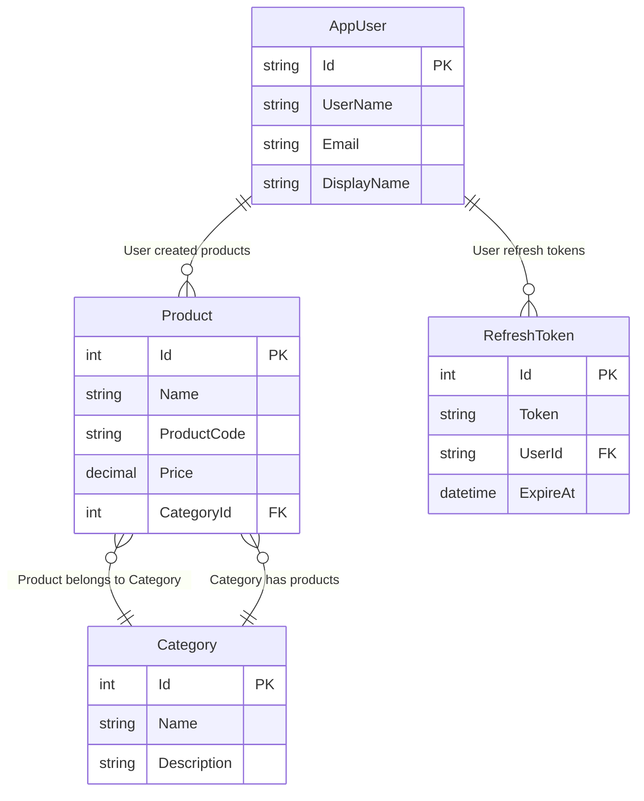
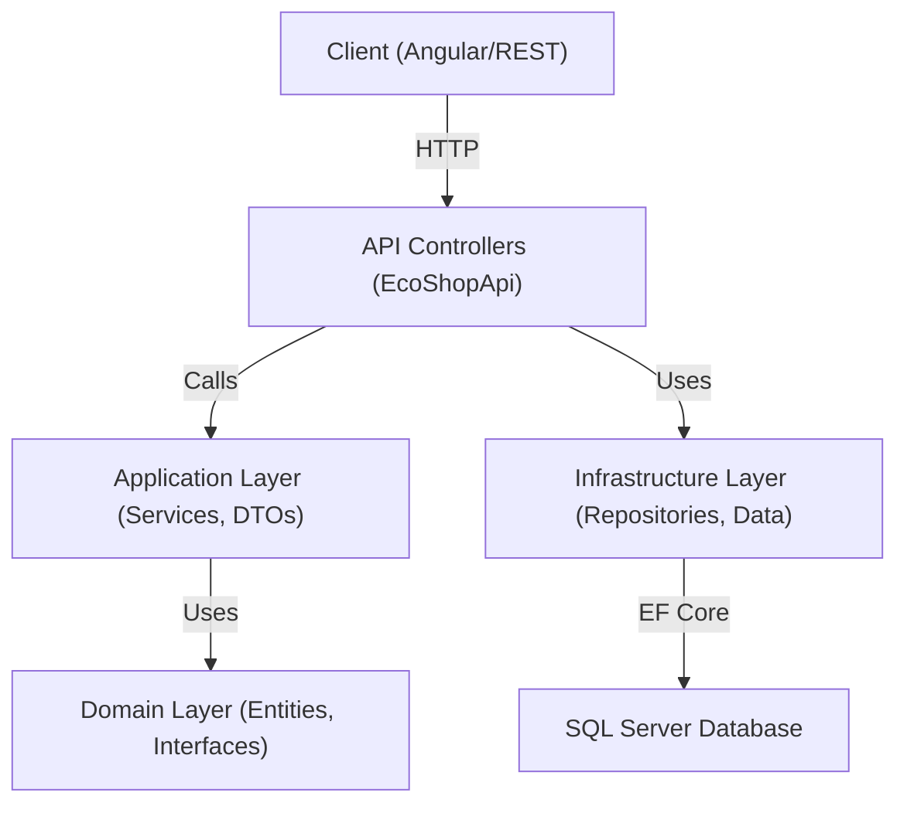

# EcoShopApi

[](https://github.com/MostafaElmarakpy/EcoShopApi)

## 📝 Project Overview & Purpose

**EcoShopApi** is a modern, extensible RESTful API for e-commerce, designed as a backend for online stores. Built with **ASP.NET Core 10** using Clean Architecture, it provides endpoints for product management, user authentication, category management, and order processing. The project is ideal for developers and businesses looking for a scalable, secure, and cleanly-architected foundation for e-commerce solutions.

---

## ✨ Key Features

- User registration, login, JWT authentication, refresh tokens
- Product CRUD (Create, Read, Update, Delete)
- Category management and product-category association
- Role-based access (Admin/User)
- Database initialization and seeding
- Entity Framework Core ORM integration
- Swagger documentation for API exploration
- CORS configuration for Angular frontend integration
- Extensible repository & unit of work patterns
- Automated migrations and seeding

---

## 🛠️ Technical Stack & Dependencies

**Frameworks & Runtimes**
- ASP.NET Core 10.0
- Entity Framework Core 10.0.9
- .NET 10.0

**Authentication & Identity**
- Microsoft.AspNetCore.Identity.EntityFrameworkCore 10.0.9
- JWT: Microsoft.AspNetCore.Authentication.JwtBearer 10.0.9
- Microsoft.IdentityModel.Tokens 8.14.0
- System.IdentityModel.Tokens.Jwt 8.0.1

**Documentation & Utilities**
- Swashbuckle.AspNetCore (Swagger) 10.0.4

**Testing**
- xUnit 2.9.2
- Moq 4.20.72
- Microsoft.NET.Test.Sdk 17.12.0
- coverlet.collector 6.0.2

**Other**
- Microsoft.Extensions.DependencyInjection 10.0.0-rc.1.25451.107

---

## 🗂️ Project Structure

```plaintext
EcoShopApi/
├── Controllers/      # API Controllers (Products, Auth, ...)
├── Application/      # Business logic, DTOs, service interfaces
│   └── Common/
│       └── Interfaces/
│       └── DTO/
├── Domain/           # Core domain entities (Product, Category, AppUser, ...)
├── Infrastructure/   # Data access, EF Core, Repos, Migrations, Seeding
│   ├── Data/
│   ├── Repository/
│   ├── Migrations/
├── Helper/           # Utility classes
├── Properties/       # launchSettings.json, etc.
├── wwwroot/          # Static files (images, etc.)
├── appsettings.json  # Configuration
├── Program.cs        # Composition root & DI setup
└── Tests.xUnit/      # Unit/integration tests
```

---

## 📡 API Endpoints

> Example endpoints (see Swagger UI for full details):

### Auth
- `POST /api/Auth/login` — User login, returns JWT
- `POST /api/Auth/register` — Register new user
- `POST /api/Auth/refresh-token` — Refresh JWT

### Products
- `GET /api/Products` — List all products
- `GET /api/Products/{id}` — Get product by ID
- `POST /api/Products/create-product` — Create a product
- `PUT /api/Products/{id}` — Update a product
- `DELETE /api/Products/{id}` — Delete a product

### Categories
- Similar endpoints for categories (GET, POST, etc.)

> For the latest, interactive documentation, launch the API and visit `/swagger`.

---

## 🚀 Installation & Running

### 1. Clone the Repository

```bash
git clone https://github.com/MostafaElmarakpy/EcoShopApi.git
cd EcoShopApi
```

### 2. Configure Database

Edit `EcoShopApi/appsettings.json` to set your SQL Server connection string:

```json
{
  "ConnectionStrings": {
    "DefaultConnection": "Server=YOUR_SERVER;Database=EcoShopDb;Trusted_Connection=True;"
  },
  "Jwt": {
    "Key": "YOUR_SECRET_KEY",
    "Issuer": "EcoShopApi",
    "Audience": "EcoShopApiUsers"
  }
}
```

### 3. Apply Migrations & Seed Data

From the root directory:

```bash
dotnet ef database update
```

This creates the schema and seeds default users, roles, categories, and products.

### 4. Run the API

```bash
dotnet run --project EcoShopApi/EcoShopApi.csproj
```

- API runs at: `http://localhost:5039`
- Swagger UI: `http://localhost:5039/swagger`

---

## 🧩 Dependencies

Core NuGet dependencies (see `.csproj` for full list):

- Microsoft.AspNetCore.Identity.EntityFrameworkCore (9.0.9)
- Microsoft.EntityFrameworkCore.SqlServer (9.0.9)
- Microsoft.AspNetCore.Authentication.JwtBearer (9.0.9)
- Swashbuckle.AspNetCore (9.0.4)
- Moq, xUnit, coverlet.collector (testing)

---

## 🗺️ Entity Relationship Diagram (ERD) — Conceptual



- **Identity tables** (AspNetUsers, AspNetRoles, etc.) are included via ASP.NET Core Identity.

---

## 🏗️ Design Patterns Overview

### 1. Repository Pattern
- All data access is abstracted behind interfaces (`IGenaricRepository<T>`, `IUserRepository`, etc.)
- Concrete repositories implement the business contract and centralize database queries.

### 2. Unit of Work Pattern
- The `UnitOfWork` class exposes repository properties and a single `Save()` method, ensuring atomic saves and transaction consistency.

### 3. Dependency Injection (DI)
- All services, repositories, and infrastructure dependencies are registered and injected via constructors using built-in DI in `Program.cs`.

### 4. Clean Architecture
- Strict separation of concerns: **Domain**, **Application**, **Infrastructure**, **Presentation** layers.

### 5. DTOs & Mapping
- DTOs are used for API contracts and data transfer between layers.

---

## 🔎 Visual Summary



## 📣 Additional Notes

**Project Structure**
- **Frontend:** Angular — [EcoShopClient](https://github.com/MostafaElmarakpy/EcoShopClient)
- **Backend:** ASP.NET API — [EcoShopApi](https://github.com/MostafaElmarakpy/EcoShopApi)

**Future Enhancements**
- E-payment integration
- Inventory management
- Product rating system

**Architecture**
- Implements Clean Architecture principles
- Separation of concerns
- Enhanced testability and maintainability
